# 🌲 Customer Churn Prediction — Random Forest Ensemble

**Predicting telecom customer churn with an ensemble of 100 decision trees — and a transparent audit of where the model wins, where it struggles, and what would fix it.**


---

## 📌 Overview

Customer churn is one of the highest-leverage problems in telecom — every customer a model correctly flags as "at risk" is a retention offer that can be sent before it's too late, and every customer it misses is silent revenue loss. This project builds a **Random Forest Classifier** on the IBM Watson Telecom Customer Churn dataset and evaluates it the way a business stakeholder would: not just "what's the accuracy," but *"which customers are we still losing, and why."*

It's the ensemble-learning follow-up to an earlier single-tree churn model in this portfolio — same dataset, upgraded algorithm — and it's built specifically to compare **two different ways of asking "which features matter": built-in Gini/entropy importance vs. Leave-One-Feature-Out (LOFO) impact testing.**

---

## 📊 Dataset

| Attribute | Detail |
|---|---|
| Source | IBM Watson Telecom Customer Churn dataset |
| Records | 7,043 customers |
| Raw Features | 20 (demographic, account, and service attributes) + target |
| Target | `Churn` (Yes/No → binary encoded) |
| Class Balance | ~26.5% churned / ~73.5% retained — **moderately imbalanced** |

---

## ⚙️ Pipeline

```mermaid
flowchart LR
    A[Raw CSV<br/>7,043 rows × 21 cols] --> B[Data Cleaning<br/>TotalCharges → numeric, index by customerID]
    B --> C[Label Encoding<br/>16 categorical columns]
    C --> D[EDA<br/>Correlation Heatmap]
    D --> E[Train/Test Split<br/>80 / 20]
    E --> F[Random Forest<br/>100 trees, entropy criterion]
    F --> G[Evaluation<br/>Accuracy · Confusion Matrix · ROC · PR]
    G --> H[Feature Importance<br/>Gini vs LOFO]
    H --> I[Reduced-Feature<br/>Model Comparison]
```



---

## 🧠 Model Configuration

| Parameter | Value |
|---|---|
| Algorithm | `RandomForestClassifier` (scikit-learn) |
| Estimators | 100 trees |
| Split Criterion | Entropy |
| Train/Test Split | 80% / 20%, `random_state=42` |
| Preprocessing | Label Encoding on 16 categorical fields |

---

## 📈 Results

| Model Variant | Train Accuracy | Test Accuracy | ROC-AUC | PR-AUC (Avg. Precision) |
|---|---|---|---|---|
| **Full-feature Random Forest** (19 features) | 99.86% | **79.70%** | **0.84** | **0.65** |
| Top-5-feature RF (importance > 0.05) | 99.41% | 77.15% | — | — |
| LOFO-optimal (weakest feature dropped) | — | **80.06%** | — | — |

**Churn-class detail (the number that actually matters for retention):** precision 0.67, recall **0.46**, f1-score 0.55 — vs. 0.83 / 0.92 / 0.87 for the "not churn" class.

---

## 🖼️ Visuals

**Feature Importance (Gini)** — billing and tenure dominate; demographic fields contribute almost nothing.


**Confusion Matrix** — the model is far more confident spotting loyal customers than at-risk ones.


**ROC Curve (AUC = 0.84)** — strong overall ranking ability across thresholds.


**Precision–Recall Curve (AP = 0.65)** — the more honest view on an imbalanced target; performance is noticeably lower than the ROC curve suggests.


**Sample Tree (top 3 levels of one of the 100 estimators)**


**Feature Correlation Heatmap**


---

## 🔎 Key Findings — An Honest Audit

Rather than stopping at "80% accuracy," this project interrogates the model the way a reviewer would before it ever reaches production.

**1. Overfitting gap.** Training accuracy sits at 99.86% against a 79.70% test accuracy — a ~20-point gap that's a textbook sign of high variance. 100 unconstrained trees are memorizing training noise. *Next step: constrain `max_depth` / `min_samples_leaf` and validate with GridSearchCV + Stratified K-Fold, the same approach used in the companion churn project.*

**2. The recall problem is the real story.** ROC-AUC of 0.84 looks strong, but the Precision-Recall curve (AP = 0.65) tells the truer story on an imbalanced target: the model only **catches 46% of customers who actually churn** — meaning more than half of at-risk customers slip through with no retention outreach at all. For a business use case built around *preventing* churn, recall on the churn class is arguably more important than overall accuracy. *Next step: `class_weight='balanced'`, SMOTE oversampling, or moving the decision threshold using the PR curve above.*

**3. Feature filtering hurt more than it helped.** Keeping only the 5 features above a 0.05 importance threshold *dropped* test accuracy from 79.70% to 77.15%. Meanwhile, the LOFO experiment — which tests removal one feature at a time rather than trusting a static importance score — found that dropping a single low-value feature (`Dependents`) nudged accuracy *up* to 80.06%. The takeaway: **Gini importance ranks correlation, LOFO tests necessity** — they aren't interchangeable, and a feature can be "unimportant" without being safe to remove in bulk.

**4. Label Encoding on nominal data is a known limitation.** Fields like `PaymentMethod`, `Contract`, and `InternetService` have no natural order, but `LabelEncoder` assigns them integers (0, 1, 2, 3) that Random Forest can implicitly treat as ordinal. It didn't break the model here since tree splits are threshold-based, but it's not best practice. *Documented as a fix for the next iteration: One-Hot Encoding for true nominal fields.*

**5. Reproducibility.** The notebook currently loads data from a hardcoded local path — flagged here and fixed to a relative path in this repo so the notebook runs on any machine.

---

## 🛠️ Tech Stack

| Category | Tools |
|---|---|
| Language | Python 3 |
| Data Handling | pandas, NumPy |
| Modeling | scikit-learn (`RandomForestClassifier`, `LabelEncoder`) |
| Evaluation | scikit-learn metrics (accuracy, confusion matrix, classification report, ROC, precision-recall) |
| Visualization | Matplotlib, Seaborn, Plotly |

---

## 🚀 How to Run

```bash
git clone https://github.com/vishnusai2005/<repo-name>.git
cd <repo-name>
pip install -r requirements.txt
jupyter notebook "Random Forest Implementation.ipynb"
```

**requirements.txt**
```
pandas
numpy
matplotlib
seaborn
plotly
scikit-learn
jupyter
```

---

## 📁 Repository Structure

```
├── Random Forest Implementation.ipynb   # Full notebook: EDA → model → evaluation → feature analysis
├── data/
│   └── Telecom_Customer_Churn.csv
├── assets/                              # Charts referenced in this README
├── README.md
└── requirements.txt
```

---

## 🗺️ Roadmap

- [ ] Hyperparameter tuning via GridSearchCV / RandomizedSearchCV (`max_depth`, `min_samples_leaf`, `max_features`) to close the overfitting gap
- [ ] `class_weight='balanced'` or SMOTE to address churn-class recall
- [ ] One-Hot Encoding for nominal categorical fields
- [ ] Stratified K-Fold cross-validation for a more reliable accuracy estimate
- [ ] Business-optimal threshold selection using the PR curve rather than the default 0.5 cutoff
- [ ] Deployment: sklearn Pipeline + joblib → FastAPI backend → Streamlit frontend

---

## 👤 About the Author

**Vydhyam Vishnusai** — Final-year B.Tech CSE (AI & ML) student building a portfolio of end-to-end ML projects, from data diagnostics to deployment-ready pipelines.

- 🔗 LinkedIn: [in/vishnusai-vydhyam](https://linkedin.com/in/vishnusai-vydhyam)
- 🐦 X (Twitter): [@VishnusaiSaii](https://x.com/VishnusaiSaii)
