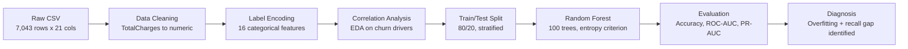

# 📡 Customer Churn Prediction with Random Forest

**Predicting which telecom customers are about to leave — before they do.**

[](https://www.python.org/)
[](https://scikit-learn.org/)
[](https://pandas.pydata.org/)
[](https://plotly.com/)
[](LICENSE)

---

## 🎯 TL;DR for Recruiters

I built an **ensemble machine learning model** that predicts customer churn for a telecom company with **80% test accuracy** and an **ROC-AUC of 0.84**, using a 100-tree Random Forest trained on 7,043 real customer records. Beyond just training a model, I **diagnosed a ~20-point train/test accuracy gap as overfitting**, identified the model's weak spot (missed churners), and mapped out a concrete, prioritized plan to fix it — the same workflow expected of an ML engineer on the job, not just a notebook exercise.

---

## 💼 Why This Matters (Business Context)

Customer churn is one of the most expensive problems in subscription-based businesses. In telecom specifically, acquiring a new customer typically costs **5–7x more** than retaining an existing one. A model that can flag at-risk customers *before* they cancel lets a business:

- Target retention offers (discounts, upgrades, support calls) only at customers who actually need them
- Protect recurring revenue instead of reacting after cancellation
- Quantify which service factors (contract type, billing method, tenure) are driving customers away

This project simulates exactly that workflow: take raw customer data → find the churn signal → build a model → **honestly evaluate whether it's good enough to act on**.

---

## 📊 Dataset

| Detail | Value |
|---|---|
| Source | Telecom Customer Churn dataset |
| Records | 7,043 customers |
| Features | 20 (demographics, account info, services subscribed) |
| Target | `Churn` (Yes/No, binary) |
| Class balance | ~73% retained / ~27% churned (imbalanced) |

Feature categories included customer demographics (gender, senior citizen status, partner/dependents), account details (tenure, contract type, payment method, billing), and subscribed services (phone, internet, streaming, tech support, security add-ons).

---

## 🔬 Methodology



1. **Data cleaning** — coerced `TotalCharges` from string to numeric, handled missing values, set `customerID` as index.
2. **Label encoding** — converted 16 categorical columns (contract type, payment method, internet service, etc.) into numeric form for the model.
3. **Exploratory data analysis** — correlation heatmap across all encoded features to understand what actually drives churn before touching a model.
4. **Train/test split** — 80/20 split (`random_state=42` for reproducibility).
5. **Model training** — `RandomForestClassifier` with 100 trees and entropy-based splitting.
6. **Evaluation** — accuracy, confusion matrix, precision/recall/F1 per class, ROC-AUC, and Precision-Recall AUC (the right metric for an imbalanced target).

---

## 📈 Exploratory Insights


**Key patterns found before modeling:**
- 🔻 Churn **decreases** with longer tenure, long-term contracts, and add-on services like Online Security and Tech Support.
- 🔺 Churn **increases** with higher monthly charges, paperless billing, and (slightly) senior citizen status.
- `Tenure` and `TotalCharges` are strongly correlated — long-standing customers naturally accumulate higher lifetime billing.
- `Gender` has almost no relationship with churn — an unhelpful feature for prediction.

---

## 🌳 Inside the Forest

One of the 100 decision trees in the ensemble, visualized to the top 2 splits, shows how the model actually reasons about a customer:


---

## ✅ Results

| Metric | Training | Testing |
|---|---|---|
| **Accuracy** | 99.84% | **79.70%** |

| Class | Precision | Recall | F1-Score | Support |
|---|---|---|---|---|
| Not Churn (0) | 0.83 | 0.92 | 0.87 | 1,036 |
| Churn (1) | 0.67 | 0.47 | 0.55 | 373 |
| **Weighted Avg** | **0.78** | **0.80** | **0.78** | 1,409 |

| Curve-Based Metric | Score |
|---|---|
| ROC-AUC | 0.84 |
| PR-AUC (Average Precision) | 0.65 |


Interactive ROC and Precision-Recall curves (built with Plotly, with per-threshold breakdowns) are available in the notebook itself.

---

## 🔍 Honest Diagnosis (Not Just the Good News)

A resume-driven project stops at "80% accuracy." This one doesn't. Two real problems surfaced during evaluation:

**1. Overfitting.** Training accuracy (99.84%) vs. testing accuracy (79.70%) is a ~20-point gap — the untuned forest is memorizing training data rather than generalizing. Left unaddressed, `max_depth` and `min_samples_split` need constraining.

**2. Weak recall on the class that actually matters.** The model catches 92% of customers who *won't* churn, but only **47% of customers who will**. In a churn-prevention product, missing over half of actual churners is the costlier mistake — every missed churner is lost revenue the business never got a chance to save. This is a direct consequence of class imbalance (~27% churn rate) that a plain accuracy score hides.

Because the PR-AUC (0.65) is meaningfully lower than the ROC-AUC (0.84), the Precision-Recall curve is the more honest lens here — ROC-AUC looks optimistic mainly *because* the negative class dominates the dataset.

---

## 🚀 Planned Improvements

- [ ] **Address class imbalance** with `class_weight='balanced'` or SMOTE to push recall up on the churn class
- [ ] **Constrain tree growth** (`max_depth`, `min_samples_split`, `min_samples_leaf`) to close the overfitting gap
- [ ] **Feature importance analysis** to drop noise features (e.g. `gender`) and engineer stronger ones
- [ ] **Hyperparameter tuning** via `GridSearchCV` / `RandomizedSearchCV` on estimator count and depth
- [ ] **Benchmark against boosting models** (Gradient Boosting, XGBoost, LightGBM), which typically handle imbalanced tabular data better than bagging-based Random Forests

---

## 🛠️ Tech Stack

| Category | Tools |
|---|---|
| Language | Python 3 |
| Data Handling | Pandas, NumPy |
| Visualization | Matplotlib, Seaborn, Plotly |
| Modeling | Scikit-learn (`RandomForestClassifier`, `LabelEncoder`) |
| Evaluation | Confusion Matrix, Classification Report, ROC-AUC, PR-AUC |
| Environment | Jupyter Notebook (Google Colab) |

---

## 📁 Repository Structure

```
Random-Forest-Churn-Prediction/
├── Random_Forest_Implementation.ipynb   # Full end-to-end notebook
├── assets/
│   ├── correlation_heatmap.png
│   ├── decision_tree_sample.png
│   └── confusion_matrix.png
└── README.md
```

---

## ▶️ How to Run

```bash
git clone https://github.com/vishnusai2005/<repo-name>.git
cd <repo-name>
pip install pandas numpy matplotlib seaborn scikit-learn plotly
jupyter notebook Random_Forest_Implementation.ipynb
```

Or open it directly in Google Colab and upload the `Telecom_Customer_Churn.csv` dataset.

---

## 🧠 Skills Demonstrated

`Data Cleaning` · `Categorical Encoding` · `Exploratory Data Analysis` · `Ensemble Learning (Random Forest)` · `Model Evaluation on Imbalanced Data` · `ROC/PR Curve Analysis` · `Overfitting Diagnosis` · `Interactive Data Visualization` · `Business-Oriented ML Reporting`

---

## 🤝 Let's Connect

I'm a final-year AI & ML student building a portfolio of end-to-end ML projects and actively looking for entry-level ML/AI roles. If this project resonates with what your team is building, I'd love to talk.

- 💼 LinkedIn: [in/vishnusai-vydhyam](https://linkedin.com/in/vishnusai-vydhyam)
- 🐦 X (Twitter): [@VishnusaiSaii](https://x.com/VishnusaiSaii)
